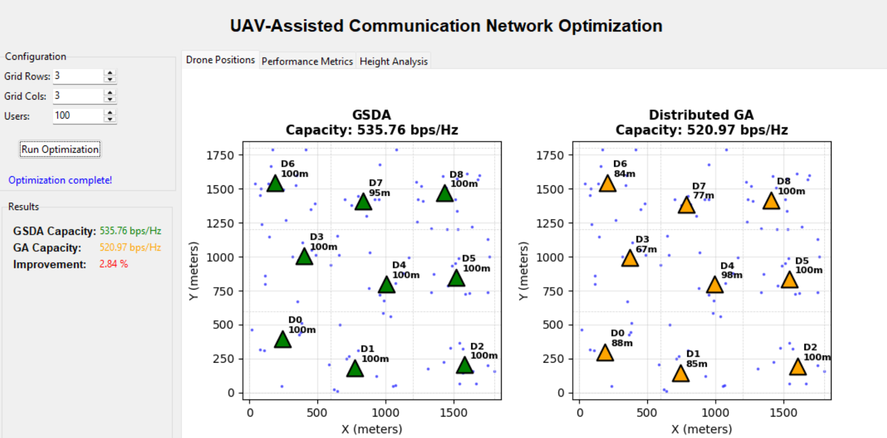

# UAV-Assisted Communication Network Optimization

A Python-based optimization framework comparing **Gradient-based Swarm Descent Algorithm (GSDA)** with **Distributed Genetic Algorithm (GA)** for UAV (drone) positioning in wireless communication networks.



## 📋 Overview

This project implements and visualizes two distributed optimization algorithms for positioning Unmanned Aerial Vehicles (UAVs) to maximize communication network capacity. The system considers:

- **Realistic radio propagation models** (Free Space Path Loss, LoS probability)
- **Neighbor-only interference** modeling
- **3D positioning optimization** (x, y, altitude)
- **Zone-based deployment** constraints
- **Analytic gradient computation** for GSDA

## 🚀 Features

- **Interactive GUI** built with Tkinter and Matplotlib
- **Real-time visualization** of drone and user positions
- **Performance comparison** between GSDA and Distributed GA
- **Configurable parameters**: grid size, user count, iteration limits
- **Multiple analysis views**:
  - Drone position maps (side-by-side comparison)
  - Performance metrics and capacity charts
  - Height distribution analysis
- **Reproducible results** with optional random seed control

## 🎯 Key Results

Based on typical scenarios:

- **GSDA achieves higher capacity** than Distributed GA
- **GSDA converges to optimal heights** (~100m for better LoS)
- **GA shows more exploration** with varied height distributions

## 📦 Installation

### Prerequisites

- Python 3.8 or higher
- Git

### Clone the Repository

```bash
git clone https://github.com/PrahasGR/UAV_optimisation.git
cd UAV_optimisation
```

### Install Dependencies

```bash
pip install -r requirements.txt
```

**Required packages:**

```
numpy
matplotlib
```

Or install manually:

```bash
pip install numpy matplotlib
```

## 🖥️ Usage

### Running the GUI Application

From the project root directory:

```bash
python -m frontend.app
```

Or on Windows PowerShell:

```powershell
PS C:\path\to\UAV_optimisation> python -m frontend.app
```

### Using the GUI

1. **Configure Parameters:**

   - Set grid dimensions (rows × columns)
   - Adjust number of users
   - Configure algorithm iterations
   - Toggle random seed for varied results

2. **Run Optimization:**

   - Click "Run Optimization" button
   - Wait for both algorithms to complete
   - View results in multiple tabs

3. **Analyze Results:**
   - **Drone Positions Tab**: Compare GSDA vs GA positioning
   - **Performance Metrics Tab**: View capacity comparisons
   - **Height Analysis Tab**: Examine altitude distributions

## 📊 Project Structure

```
UAV_optimisation/
│
├── backend/
│   ├── src/
│       ├── gsda.py           # Core GSDA and GA algorithms
│       └── utils/
│           └── utils.py      # Radio propagation models
│
│
├── frontend/
│   └── app.py                # GUI application
│
├── assets/
│   └── ui_screenshot.png     # UI screenshot for README
│
├── README.md
└── requirements.txt
```

## 🔬 Algorithm Details

### GSDA (Gradient-based Swarm Descent Algorithm)

- Uses **analytic gradients** derived from radio propagation equations
- Implements **coordinate descent** (optimizes x, y, h sequentially)
- Employs **consensus averaging** with neighbor communication
- Includes **projection** to maintain zone constraints

**Key Parameters:**

- `K_outer`: Outer iterations (default: 10)
- `K_sub`: Inner iterations per coordinate (150, 150, 400)
- `s_vals`: Step sizes (3000, 3000, 900)

### Distributed GA (Genetic Algorithm)

- Each drone runs **local GA optimization**
- Uses **tournament selection** and crossover
- Implements **adaptive mutation** with Gaussian noise
- Respects **zone boundaries** through projection

**Key Parameters:**

- `KG`: Global iterations (default: 3)
- `ga_pop`: Population size (default: 10)
- `ga_gen`: Generations per iteration (default: 15)

## 📈 Performance Metrics

The system evaluates:

1. **Total Network Capacity** (bits/Hz)

   - Sum of Shannon capacities across all users
   - Accounts for SINR with neighbor interference

2. **Per-Drone Contribution**

   - Individual drone performance analysis

3. **Height Optimization**
   - Statistical analysis of altitude distributions
   - Impact on Line-of-Sight probability

**Example Configuration Snippet:**

```python
self.rows = 3          # Grid rows
self.cols = 3          # Grid columns
self.num_users = 100   # Number of users
```

## 📝 Example Output

```
Running GSDA (analytic gradient)...
[GSDA] k= 1
[GSDA] k= 2
...
[GSDA] k= 10
GSDA capacity: 475.93 bps/Hz

Running distributed GA...
GA capacity: 443.61 bps/Hz

Improvement: 7.22%
```

## 👥 Authors

- **Prahas G R**
- **Vineet Nayak M**
- **Nishant K**
- **Nischal B**

## 📧 Contact

For questions or issues, please open an issue on the [GitHub repository](https://github.com/PrahasGR/UAV_optimisation/issues).
